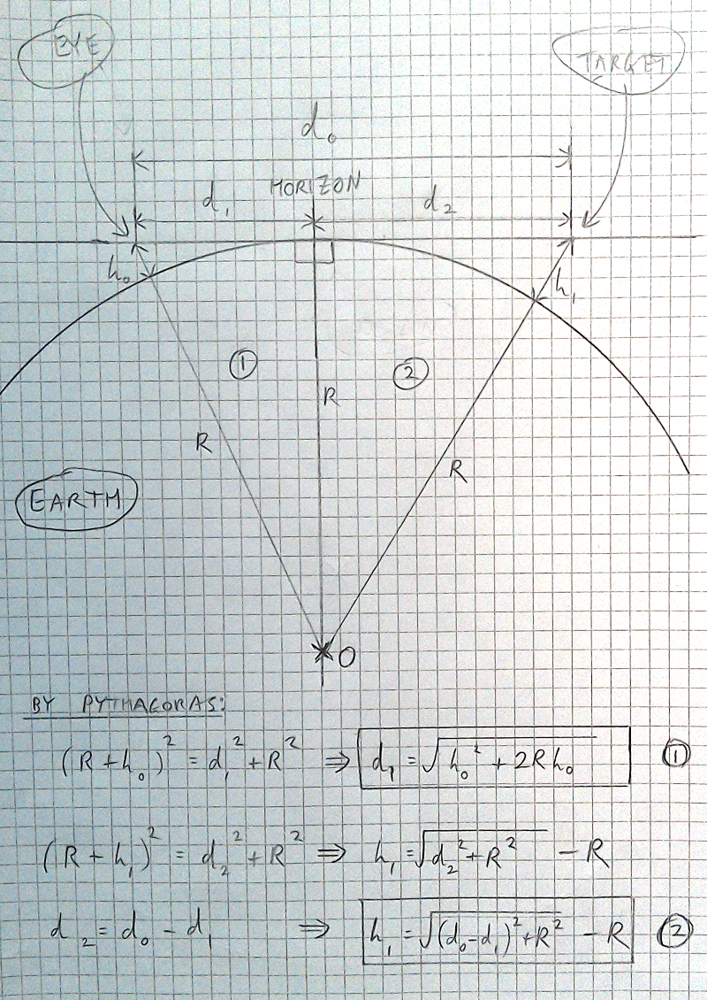

# calculation method

# developer build and run

With [node.js] installed on the target box:

    $ git clone --branch=dev https://github.com/dizzib/earthcalc.git
    $ cd earthcalc
    $ npm install       # install project dependencies
    $ npm start         # start the task runner
    earthcalc > b.all   # build everything

You should now be able to point your browser at `_build/site/index.html`

## license

[MIT](./LICENSE)

[LiveScript]: http://livescript.net/#installation
[node.js]: http://nodejs.org/download/
[repo]: https://github.com/dizzib/earthcalc
